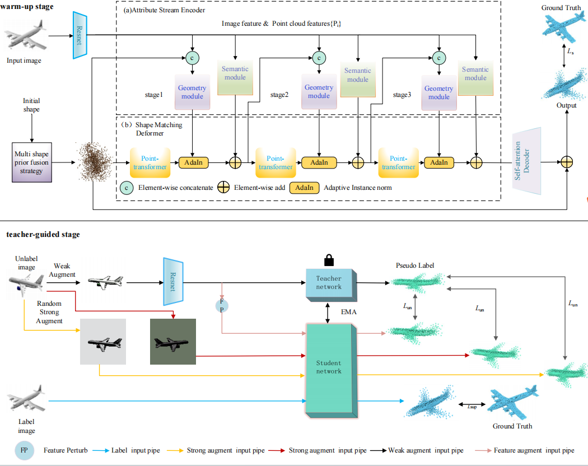
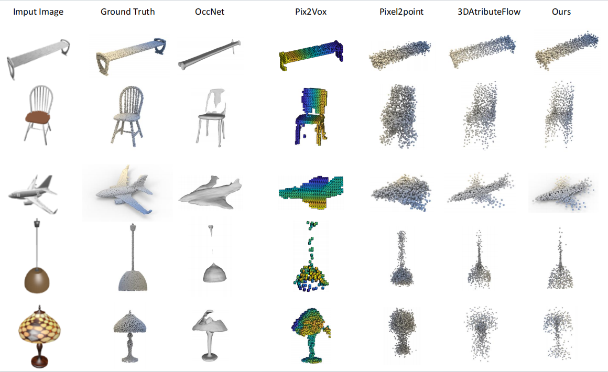
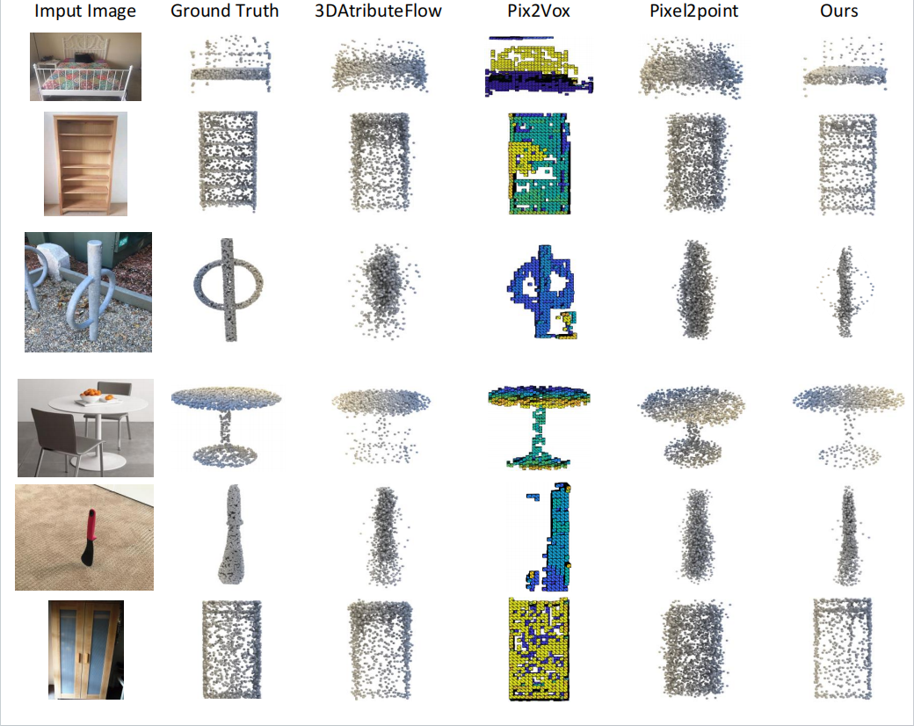

# SSMP


## Requirements
The code has been tested on NVIDIA GeForce RTX3090 GPU with Ubantu20.04 , Python 3.7.9, PyTorch 1.11.0, CUDA 11.3

```
pip install -r requirements.txt
```

```
python setup.py install --user
# PointNet++
pip install "git+https://github.com/erikwijmans/Pointnet2_PyTorch.git#egg=pointnet2_ops&subdirectory=pointnet2_ops_lib"
# GPU kNN
pip install --upgrade https://github.com/unlimblue/KNN_CUDA/releases/download/0.2/KNN_CUDA-0.2-py3-none-any.whl
```
#### Overall Network architecture:
The network architecture of SSMP is shown below:
<p float="left">
    
</p>

## Train time
the training time for the warm up stage is 40 seconds, and the training time for the teacher guidance stage is 40 minutes

## Train log
We have provided training logs to validate the effectiveness of the model. log is [here](https://drive.google.com/file/d/165rSEbKtlWyyxyxvE_S_7ZVTO8ArUYxc/view?usp=drive_link)

## Datasets
Our prepared shapenet dataset is available [here](https://drive.google.com/file/d/1I0phYe60FHLj3rQcJGl0BN5RLPVCqSh5/view?usp=sharing) and pix3d dataset is available [here](https://drive.google.com/file/d/1O1XTTTX1LKj0eO1kT6HS_A0YAKbv8AOw/view?usp=drive_link)

## Pretrained Models
The pretrained models on Pix3D are available [here](https://drive.google.com/file/d/1xZ1t9B3Svf8E0eYF2YtoUUFiLorDxoPV/view?usp=drive_link) 

## Train Shapenet Datasets

### Set ShapeNet datasets
You should modify the dataset path in the config.py file.
```
DATASETS.SHAPENET.RENDERING_PATH = 'path/to/shapenet/%s/%s/rendering/%02d.png'
DATASETS.SHAPENET.POINT_PATH=  'path/to/shapenet_point/%s/%s'+'.npy''
```

### train stage1
```
python runner.py
```
### train stage2
```
python runner.py --finetune --weights=xxx.pth
```
### test 
```
python runner.py --test --weights=xxx.pth
```
### Performance:

| CD       | Airplane | Bench | Cabinet | Chair | Video | Lamp | Speaker | Rifle | Sofa | Table | Phone | Vessel | Avg |
|--------------|----------|-------|---------|-------|-------|------|---------|-------|------|-------|-------|--------|-----|
| This repo     | 3.08     | 5.30  |  7.67    |  6.40  | 6.37  | 7.29 | 9.07    | 2.90  | 5.83 | 6.85  | 4.83  | 4.96   | 5.91|

### Visualization:
#### Usage:
.obj  file can be loaded into [MeshLab](https://www.meshlab.net) for visualization. 
#### Results:
The visualization result:
<p float="left">
    
</p>

## Train Shapenet Datasets

### Set Pix3d datasets
You should modify the dataset path in the config.py file.
```
DATASETS.PIX3D.RENDERING_PATH  = 'path/to/pix3d/img/%s/%s.%s'
DATASETS.PIX3D.POINT_PATH =  'path/to/pix3d/model/%s/%s/%s'
```

### train stage1
```
python runner.py --datatype="Pix3D"
```
### train stage2
```
python runner.py --finetune --weights=xxx.pth  --datatype="Pix3D"
```
### test 
```
python runner.py --test --weights=xxx.pth --datatype="Pix3D"
```
### Performance:

| CD       | Bed | Bookcase | Desk | Misc | sofa | table | tool | wardrobe |Avg |
|--------------|----------|-------|---------|-------|-------|------|---------|-------|---|
| This repo     | 6.73     | 6.48  |  7.11    |  13.44  | 4.60  | 8.07 | 11.66    |  3.42  | 6.53 |

### Visualization:
#### Usage:
.obj  file can be loaded into [MeshLab](https://www.meshlab.net) for visualization. 
#### Results:
The visualization result:
<p float="left">
    
</p>
